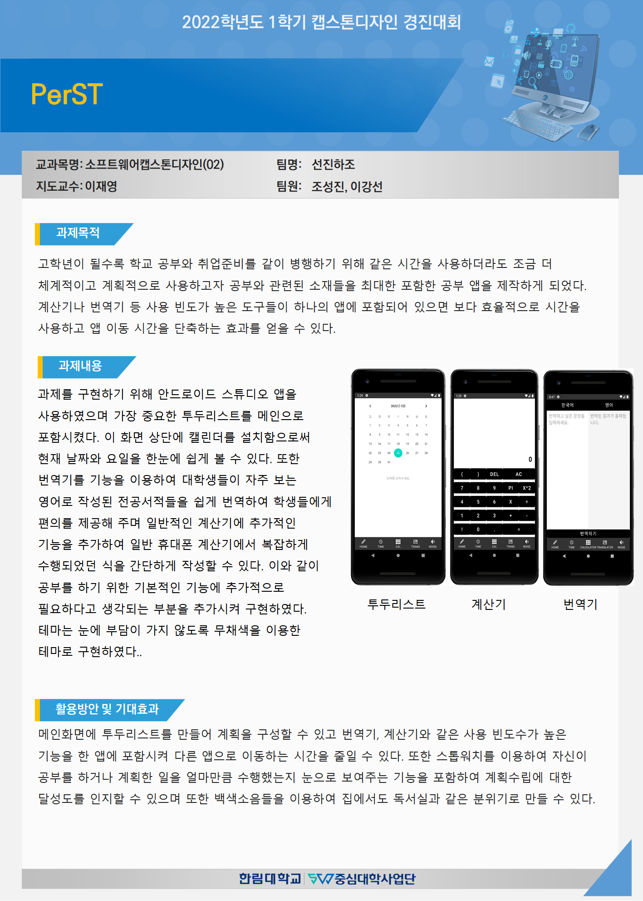

## 2022 소프트웨어캡스톤디자인 (한림대학교 소프트웨어융합대학)
## **PerST (Perfect Study Trainer)**

### 참여자
* 조성진 (팀장)
* 이강선

### 지도교수
* 이재영 교수님

### 과제 개요
* 공부의 효율을 위해 다양한 기능을 포함한 안드로이드 앱 개발

### 도움 기업
* 소풍컴퍼니 윤정관 대표

### 회의 내용
* 0309
  * 신청서 작성 및 제출
  * 앱 설계 스케치
* 0323
  * 앱 설계 스케치 확인 후 수정 및 정리
  * 참고문헌 대여 및 공부 (xml, java)
  * Android Studio 앱 설치 및 사용법 공부
* 0330
  * 프로그래밍
    * 백색소음, 명언 구현
    * 투두리스트 구조 설계
  * 질의응답
* 0406
  * 중간보고서 작성
  * 프로그래밍
    * 백색소음, 명언 구현 마무리
    * 투두리스트 구조 설계 마무리
    * 투두리스트 구현
    * 타임 구조 설계
  * 질의응답
* 0427
  * 0425: 중간보고서 수정 및 제출
  * 프로그래밍
    * 타임 구조 설계에 대한 오류 처리
    * 백색소음 구현 마무리 (오류수정 및 확인작업)
    * 타임 구현
    * 하단 메뉴 구현 및 코드 정리
    * 번역기 구조 설계
  * 질의응답
* 0518
  * 기업체 멘토링 후 자문보고서 작성
  * 포스터 작성
  * 발표자료 작성 -- 진행중
  * 지원금 관련 문서 작성
  * 프로그래밍
    * 구현 마무리
    * 설계 마무리
* 0525
  * 교수님 면담: 질의응답, 진행상황(결과) 보고
  * 결과 보고서 작성
  * 시연 동영상 촬영
  * 발표자료 작성 마무리
  * 포스터 작성 수정 및 보완
  * 깃허브 정리
---

### 포스터

